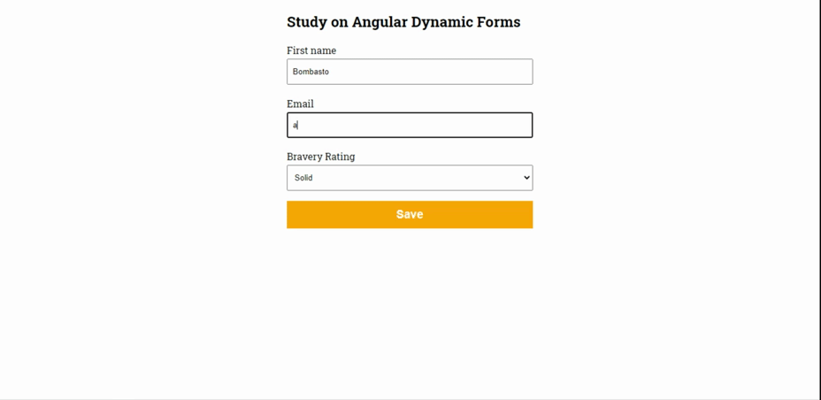

<div align="center">
  <h1>Dynamic Forms Angular</h1>


  
</div>

___
## About

This project was generated with [Angular CLI](https://github.com/angular/angular-cli) version 10.0.1. The focus is on studying Dynamic Forms with Angular.


## Tecnologies
- [Angular](https://angular.io)
- [SCSS](https://sass-lang.com/)

## How to run this project?

``` bash
  $ git clone https://github.com/adrianofelisberto/dynamic-forms-angular.git

  $ cd dynamic-forms-angular

  $ npm install

  $ npm start

```

Then, you should be opened your browser and access http://localhost:4200

